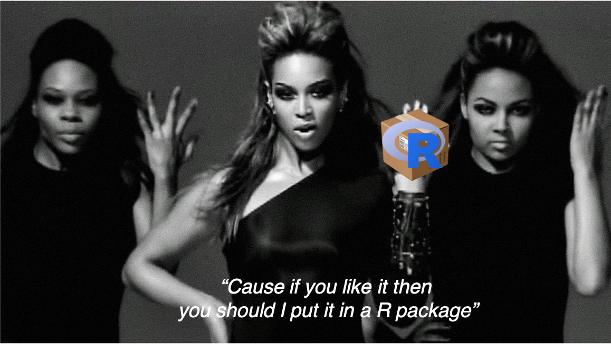

### RLadies Sydney July 2020 

# DIY R package workshop 

### Hello! Welcome! 👋

For this interactive workshop, we will be making [ohwhaley](https://github.com/fontikar/ohwhaley) the R package together 🐋

**Participants should have the following ready for the workshop**

- The most recent version of R (≥ 4.1) and RStudio (≥1.4) installed
- The following package(s) and their dependencies installed: devtools, testthat, knitr
- Basic understanding of how to write a function
- Basic usage of [git](https://jennybc.github.io/2014-05-12-ubc/ubc-r/session03_git.html) *optional but recommended
- Basic understanding of project directories and .Rproj files

**For the workshop, we will be working from main_functions.Rmd** 

This file is also neatly rendered here so its easier to read: https://fontikar.github.io/RladiesSYD_DIYRpkg/ 

### Meta data

I have also provided the bulk of the code in `templates/`:

- `say.R` R script containing the `say()` function for `ohwhaley`
- `phrases.R` R script containing phrases used by `say()`
- `test-say.R` R script containing a simple test for `say()`
- `roxygen_template.R` R script containing roxygen documentation for `say()`
- `data_template.R` R script containing roxygen template for documenting external data
- `example_README.Rmd` Rmd file for the README
- `example_vignette.Rmd` Rmd file for the vignette

I have also included my slides in `slides/`

Read more about R packages, I recommend the 2nd Edition of [The R packages book](https://r-pkgs.org/) by Hadley Wickham and Jenny Byran

### Overview of workshop:

1. What is an R package?
2. Why make an R packge [a breakout discussion]
3. The mise en place
  - R and RStudio
  - git and GitHub *optional, but recommended
4. The basic packages
  - devtools
  - usethis
  - testthat
  - roxygen2
  - knitR
5. Lets get coding! [interactive part]
  - The main set up
  - Your first function
  - Document it!
  - README
  - Vignette
  - Tests
6. What makes a good R package? [breakout discussion] *If there is time
7. Summary

### Additional resources
If you want to give your package something *extra*:

- [Badges](https://github.com/GuangchuangYu/badger) in your README 
- [Hexsticker](https://github.com/GuangchuangYu/hexSticker) in your README and to print 😍
- [Pkgdown](https://pkgdown.r-lib.org/) website 
- Continuous integration using [GitHub Actions](https://github.com/r-lib/actions)

