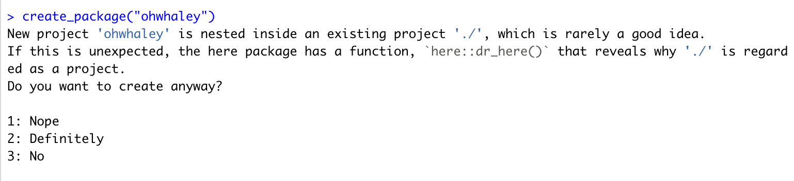

```{r BTS, include=FALSE}
knitr::opts_chunk$set(echo = TRUE,
                      warning = FALSE,
                      message = FALSE,
                      error = FALSE, 
                      eval = FALSE)

pacman::p_load(dplyr)
```

```{r klippy, eval=TRUE, echo=FALSE, include=TRUE}
klippy::klippy(position = c('top', 'right'))
```

Below are some of the main functions you will need to create your first R package! 💪

Please note 🚩 that some of the explanations are heavily borrowed from Hadley Wickham and Jenny Byran's book - ["R Packages: Oragnise, Test Document and Share your Code"](https://r-pkgs.org/index.html) which is open access! This is my go-to reference if I have a question about package development, highly recommended! ⭐️⭐️⭐️⭐️⭐️

### The mise en place 👩‍🍳

```{r Prep, class.source='klippy'}
#install.packages("devtools")

library(devtools) #Will load usesthis and roxgen2 as well
```

### The main set up

This function will create the basic skeleton of your R package 👏👏👏 

Be intentional where you create this on your computer. If you create it within another folder, R will kick up a fuss but its okay so long as you are happy with where your R package will live 🙂



```{r Set up first, class.source='klippy'}
# Create the basic skeleton of your package
# create_package("package_name")

usethis::create_package("ohwhaley")
```

**The function will open a new Rstudio window and you will need load `devtools` and `testthat` again**

```{r Reload}
#install.packages(c("devtools", "testthat"))

library(devtools) #Will load usesthis and roxgen2 as well
library(testthat)
```

### Structure of your R package

`.Rbuildignore` lists files that we need to have around but that should not be included when building the R package from source. More in 4.3.1.

`.Rproj.user`, if you have it, is a directory used internally by RStudio.

`.gitignore` anticipates Git usage and ignores some standard, behind-the-scenes files created by R and RStudio. Even if you do not plan to use Git, this is harmless.

`DESCRIPTION` provides metadata about your package. We edit this shortly.

`NAMESPACE` declares the functions your package exports for external use and the external functions your package imports from other packages. At this point, it is empty, except for a comment declaring that this is a file we will not edit by hand.

The `R/` directory is the “business end” of your package. It will soon contain .R files with function definitions.

**Optional to use git and GitHub but recommended** 

You can create an R package without using git, however one benefit of using git and GitHub is that you can then host your package in a Github repo. This allows you to easily share with others. The README.md will also auto-render so it looks pretty swish! There are many ways to use git with your existing R package or project - see [here](https://happygitwithr.com/new-github-first.html) for more info 

```{r Use git okay?, class.source = 'fold-hide'}
# Initiate git and create a Github repo from R
# Assumes you have a personal access token (PAT) set up already
use_git() 
use_github()

# If you don't have a PAT set up yet
gh_token_help() #will guide you through troubleshoot and set up
create_github_token()
gitcreds::gitcreds_set()
```

### Edit your DESCRIPTION file manually

The `DESCRIPTION` file provides metadata about your package and its also where you specify any dependencies your package may have.

- **Make yourself the author**
- **Write some descriptive text in the `Title` and `Description` fields**

As you develop your package, R will add package name(s) under the headers `Depends` or `Imports` or `Suggests` for you, but you can also do this manually

### Declare your license 

We will use the MIT license - this is the most open and permissive license
Read more about the different licenses in the [R packages book](https://r-pkgs.org/license.html) for other license requirements

```{r License up}
#Replace with your name!
use_mit_license("Firstname Surname")
```

### Routine checks 

In order to make sure your R package can build and run smoothly, we will need regularly run some sanity checks. 

**The goal is to get 0 WARNINGS, NOTES or ERRORS**

The function is pretty clever and will provide you with google-able error messages if you do run into some trouble.

```{r Check it!}
check() 
```

### Your first function

`ohwhaley` has one function only and it uses the pipe `%>%` 

We will need to first import the pipe from `magrittr` so we can use it in our package

```{r First function}
# Importing pipe from magrittr
use_pipe() 

# The document functions updates NAMESPACE so we can use the pipe in our first function
document()
# Look at NAMESPACE
```

Now we can make our first function. `use_r()` creates an R script for you in the `R/` folder. 

The file will have the same name as your function.

```{r use_r}
# Creates an R script called say.R in R/
use_r("say") 
```

**Paste in the following code into your say.R**

```{r Say whale}
say <- function(what){
  #Defining the whale ASCII
  whale = "\n            ------ \n           %s \n            ------ \n               \\\   \n                \\\  \n                 \\\
     .-'
'--./ /     _.---.
'-,  (__..-`       \\
   \\          .     |
    `,.__.   ,__.--/
     '._/_.'___.-`
"

  #If what isn't supplied...
  if(missing(what)){
    what <- phrases %>% sample(size = 1)
  }

  #Combining message and whale together with sprintf ("%s" in the whale ASCII is replaced by "what")
  out <- sprintf(whale, #Speech bubble
                 what) #User specified message 

  #Return whale message
  message(out)
}
```

`say()` has one argument `what`, if `what` isn't supplied, `say` will use a random sentence from `phrases`. We will need to also create an R script for `phrases` the same way we did as above.

```{r Create phrases}
# Creates an R script called  phrase.R in R/
use_r("phrases") 
```

**Paste in the following code into your phrases.R**

Feel free to add more phrases 🐳🐳🐳

```{r Phrases}
#' Whale pun phrases used in say()

phrases <-  c(
  "You're whale-come!",
  "How are you? I'm whaley good!",
  "I'm having a whale of a time!",
  "Whale, whale, whale...look who's here!",
  "Gee...this is over-whalming!",
  "Everything whale be alright!",
  "Get whale soon!",
  "Whale done! This looks great!",
  "What do you call a pod of noisy whales?        An ORCASTRA!"
)
```

**Lets take it for a spin!**

```{r Preview}
# Loads a preview of your early stage package
load_all() 

# Try use the function!
say()
```

💡 TIP: 

If you want to use functions from existing packages, generally you will import most of your functions from other packages by using the `::` e.g `dplyr::mutate` and then run `document()` again and R will add dplyr under `Imports` in your `DESCRIPTION` file.

🌟 EXTRA: 

- Want to write functions like dplyr where you can just type out the variable name instead of using data$var? You need to use curly braces in your function. For more details see https://dplyr.tidyverse.org/articles/programming.html 

```{r Data masking, class.source = 'fold-hide'}
var_summary <- function(data, var) {
  data %>%
    summarise(n = n(), min = min({{ var }}), max = max({{ var }}))
}

mtcars %>% 
  group_by(cyl) %>% 
  var_summary(mpg)
```

### Document it - Object documentation ✅

We will use roxygen tags to document our function. This will generate a helpfile for the `say()` function so when you type `?say()` into the console. This form of documentation is written in the same R script as your function. 

**Copy the following code and paste above the `say()` function your `say.R`**

The first line is the Title of the helpfile

- `@param` A tag for a parameter or argument in your function
- `@description` A brief description of your function
- `@usage` How is the function written out?
- `@return` What the does function return
- `@export` Including the export tag will make your function available to users, remove to keep your function for internal use
- `@examples` Examples of using the function

```{r roxgen2}
#' Summon a whale for a customisable pick-me-up
#'
#' @param what Whatever phrase you want whale to echo. If not supplied, a random phrase is chosen
#' @usage say(what)
#' @return Whale shaped message
#' @export
#'
#' @examples
#' say("You're whale-come")
```

If you want to do this manually: 

**Place your cursor *inside* the curly braces of `say()` function and click `Code > Insert Roxygen Skeleton` in RStudio, then add in your details**

Once you have filled out the roxygen tags with information relating to your function

```{r Document}
# Write documentation
document() #The function will go through your .R files and look at the roxygen tags and build/update any help files

# Notice that man/ has been added in your R package
# Notice that in NAMESPACE you can see say() because we used @export in the say() function

# Preview your recent changes
?say()
```

💡 TIPS: 

- Once you have a roxygen skeleton, hitting ENTER will continue the formatting on the next line `#'`
- Typing `@` and then hitting TAB will show you the various roxygen tags you can use for your documentation
- Use `@importFrom` to bring in LOTS of functions from other packages - `ggplot2` is a good example. Don't have to load big packages just their functions

```{r ggplot2, class.source = 'fold-hide'}
# Instead of using the :: notation like below
my_plot <- function(data, x, y){
  ggplot2::ggplot(data, ggplot2::aes(x = x, y = y)) +
    ggplot2::ggplotgeom_point()
}

# You can import the functions using the roxygen tag as below
#' @importFrom ggplot2 ggplot aes geom_point theme scale_x_discrete     
```

### README - Your landing page 🤓

The function of your `README` is to give users a quick overview of what your R package is for and to help them get started with installation. Most R packages will have a installation instructions and some demo of its main functions. For this reason, its much easier to write your README in .Rmd format. Remember to knit regularly to preview your changes. 

Knitting your .Rmd will produce a .md. If you are using git and your package is hosted on GitHub, knit your .Rmd and commit and push both files. That way your README is updated on the repository

```{r README}
# This function will create the README file for you. 
use_readme_rmd()

# If your README is more basic and doesn't contain any code, just use the basic .md format.
use_readme_md()
```

**Copy and paste the contents of example_README_vign.Rmd into your empty file**

```{r Local install}
#Since the README calls library(ohwhaley) to use its functions, we need to install it locally
install()

#Now knit and preview!
```

🌟 EXTRA: 

- You can use GitHub Actions to auto-render your .md from .RMD - see https://fromthebottomoftheheap.net/2020/04/30/rendering-your-readme-with-github-actions/ 
In my experience so far... if your README is not very extensive and doesn't get updates often then the time used to set up GitHub Actions is not worth the trouble! 

### Long form documentation 📚

Many great packages include helpful vignettes to so users can hit the ground running. Take a peak at `vignette("dplyr")`. Vignettes are usually a more extensive guide to using the package's functions with example data. Some parts may repeat the README. Try write your vignette with a beginner's mindset and explain things step by step.

You can create multiple vignettes too, perhaps include some background information or a contributing guideline so others can help add value to your package 👨‍💻🧑‍💻👩‍💻

```{r Vignette}
# use_vignette("packagename") #Creates .Rmd file for vignette inside vignette/
use_vignette("ohwhaley") 
```

**Copy and paste the contents of templates/example_vignette.Rmd into your empty .Rmd file** 

(For teaching purposes sake this vignette is just a duplicate of the README)

and then run: 

```{r Build and Browse vignette}
#Build the vignette
build_vignettes() 

#Update all the documentation
document() 

# browseVignettes("packagename") #Previews in web browser
browseVignettes("ohwhaley") 

# vignette("packagename") #Previews in help window
vignette("ohwhaley") 
```

### Finally, lets talk about tests...📝

Testing is a vital part of package development. It ensures that your code does what you want it to do. While it is not *completely* necessary for personal packages, it is best practice to include them! Try see testing as a game, its great when you pass a test right?! 

To set up tests: we rely on another R package called `testthat`

```{r Tests}
# To initiate a basic testing skeleton run: 
use_testthat() #Creates tests/ and testhat.R and testthat/ adds testhat in Suggests in your DESCRIPTION file

# To create a test script for the say() function
# use_test("function name") #Creates a test .R script in testhat/
use_test("say") #Creates a file named test-say.R 
```

**Copy and paste the followings content into your empty `test-say.R` script**

Lets have a closer look at one part of the testing script 👀


```{r Test example}
# test_that("Description of test",{
#   expect_(actual, expectation)
# })

test_that("Output is of correct format",{
  expect_length(say(), 0) #Returns something with a length of 0
  expect_null(say()) #Returns null
  expect_invisible(say()) #Returns invisibly
  expect_message(say()) #Returns a message
})
```

A `test` groups together multiple `expectations` to test the output from a simple function. This is why they are sometimes called unit tests as they test one unit of functionality. 

An `expectation` is the core building block of testing. It describes the expected result of a computation. Does it have the right value and right class? Does it produce error messages when it should? 

Expectations are functions that start with `expect_`.

Any `expect_` function has two arguments: the first is the actual result, the second is what you expect.

The first part of the `test_that()` is a description of the testing block. 

- Write down the context/scope of your test there
- After the first curly brace, you list out your expectations

**Try running your testing unit - what do you see?**

```{r Test it!}
test()
```

Now run a check. `R CMD check` will not also run your tests for you and report back if something fails. How handy!

```{r Check once again}
check()
```

### You have yourself an R package! 🥳

You can try install it!

```{r Install}
install(build_vignettes = TRUE) 
```

Alternatively, if you have git and GitHub set up...
try installing using `devtools::install_github()`

```{r Install GH}
devtools::install_github("fontikar/ohwhaley")
```

**🌟 EXTRA: Including data in your package 🗄**

Some packages have built-in data that is available for the user. In some cases, these can be used for demonstration purposes e.g. the `starwars` dataset in `dplyr`. Alternatively, some packages that are compilations of datasets e.g https://github.com/thebioengineer/tidytuesdayR

```{r Use data, class.source = 'fold-hide'}
# Lets download some cetacean data from Tidy Tuesday
cetacean_subset <- readr::read_csv("https://raw.githubusercontent.com/rfordatascience/tidytuesday/master/data/2018/2018-12-18/allCetaceanData.csv") %>% dplyr::select(species:birthYear)

# use_data(data_obj, name) #Saves the data as a .rda object in a data/ folder
use_data(cetacean_subset, name = cetacean)
```

Similar to a function, you will need to document your dataset so the meta-data can be found more easily like `?starwars`. To document the data, create a new .R script and save it as the name of the `.rda` object e.g. `cetacean.R` and store this with your functions in `R/`. 

There is no template on how to document data as far as I know but I have provided you with one in `data_template.R`

**Copy and paste in the contents of `template/data_template.R` into `cetacean.R`.** Then run: 

```{r Document data, class.source = 'fold-hide'}
# To generate the helpfile
document() 

# Load recent changes
load_all()

# Preview your recent changes
?cetacean 
```
